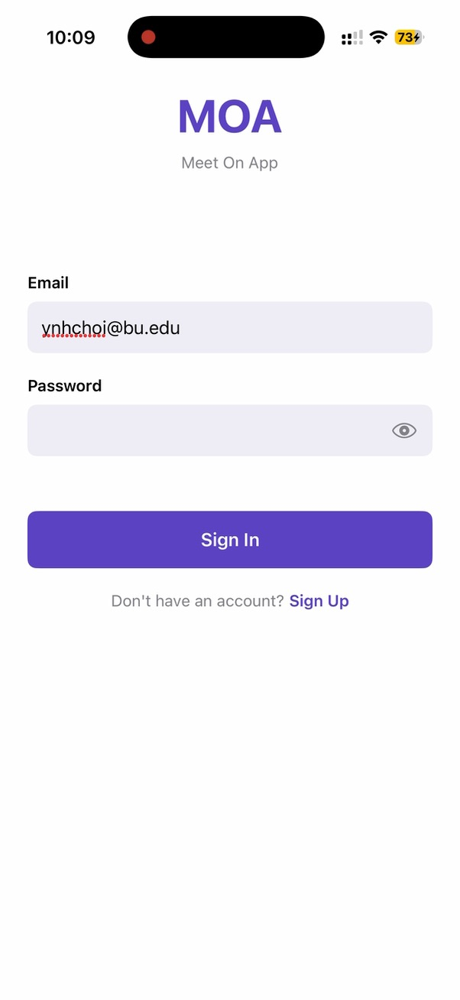
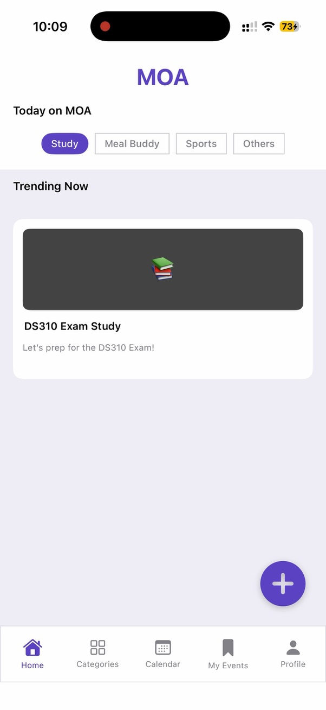
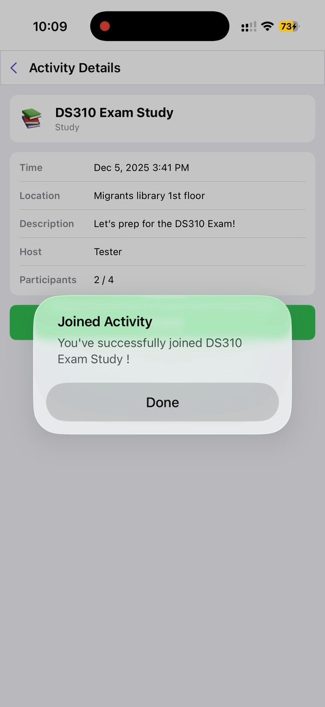
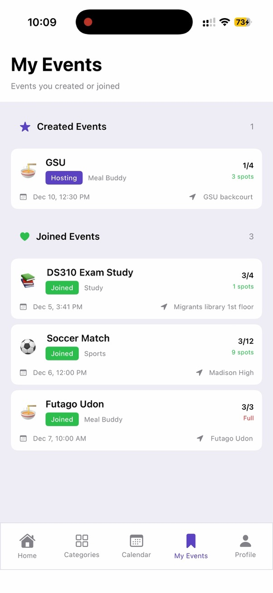
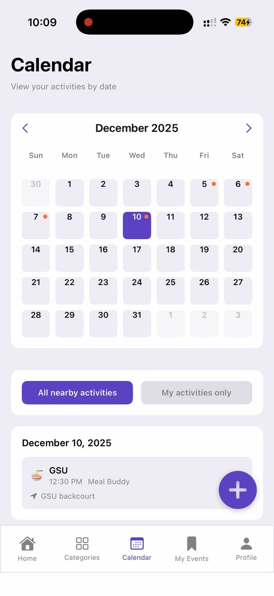
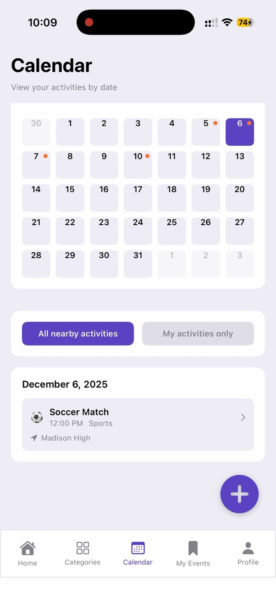

<div align="center">

# MOA — Meet On App

**A social meetup app for discovering and joining activities around you**


</div>

---

## Overview

MOA (Meet On App) is an iOS application that makes it easy to create, discover, and join local social activities. Whether it's a study session, a meal buddy, or a sports match — MOA connects people around shared interests through a clean and intuitive interface.

The app supports full user authentication, real-time activity browsing by category, event creation and joining, a personal event dashboard, and a calendar view to visualize activities by date.

---

## Screenshots

| Login | Home | Activity Details |
|:---:|:---:|:---:|
|  |  |  |

| My Events | Calendar | Calendar (Date View) |
|:---:|:---:|:---:|
|  |  |  |

---

## Features

- **Authentication** — Email/password sign-in and sign-up with Firebase Auth
- **Home Feed** — Browse trending activities filtered by category (Study, Meal Buddy, Sports, Others)
- **Activity Details** — View event info (time, location, host, participants) and join with one tap
- **Create Activity** — Post a new meetup with category, location, time, and capacity
- **My Events** — Track events you created (Hosting) and events you joined (Joined), with real-time spot counts
- **Calendar View** — Visualize all nearby or personal activities on a monthly calendar with date-based filtering

---

## Tech Stack

| Layer | Technology |
|---|---|
| iOS Frontend | Swift, SwiftUI |
| Authentication | Firebase Authentication |
| Database | Firebase Firestore |
| Backend API | Node.js, Express |
| Infrastructure | Docker |
| Version Control | Git, GitHub |
| IDE | Xcode |

---

## Project Structure

```
├── likelion/                    # iOS SwiftUI application
│   ├── MOAApp.swift             # App entry point
│   ├── FirebaseService.swift    # Firebase Firestore integration
│   ├── APIService.swift         # REST API service layer
│   ├── HomeView.swift           # Home feed
│   ├── CalendarTabView.swift    # Calendar view
│   ├── CreateActivityView.swift # Event creation flow
│   ├── LoginView.swift          # Authentication UI
│   └── ...
├── moa-backend/                 # Node.js backend server
│   ├── server.js                # Express server entry point
│   ├── routes/                  # API route handlers
│   ├── middleware/              # Auth and request middleware
│   └── docker-compose.yml       # Docker configuration
└── docs/
    └── screenshots/             # App screenshots
```

---

## My Role

- Designed and built the full iOS frontend using Swift and SwiftUI
- Integrated Firebase Authentication for secure user sign-in and registration
- Connected the app to Firebase Firestore for real-time data storage and retrieval
- Built the home feed, calendar, activity detail, and event creation views
- Implemented category-based filtering and participant capacity tracking
- Contributed to backend API design and the Firestore data migration

---

## Future Improvements

- Search and location-based filtering for nearby activities
- Push notifications for activity updates and join confirmations
- User profile customization and interest tagging
- Real-time chat within activity groups
- Enhanced UI consistency and animation polish

---

<div align="center">
  <sub>Built by <a href="mailto:yunhochoi27@gmail.com">Yunho Choi</a></sub>
</div>
